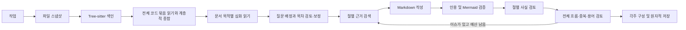

# 설계와 운영

## 실행 흐름

작업은 여러 로컬 소스, 하나의 Markdown 출력 경로, 자유 텍스트 생성 방향 및 예산으로 구성된다. 하나의 소스를 여러 목적의 작업에서 재사용할 수 있다. 실행마다 설정을 암호화한 스냅샷으로 고정한다.



상태는 `queued`, `running`, `cancelling`, `cancelled`, `interrupted`, `failed`, `completed`, `completed_with_warnings`, `awaiting_source`, `awaiting_outline`이다. 동일 출력 경로의 중복 실행은 차단하고 대기열은 64개로 제한한다. 단일 데이터 디렉터리는 프로세스 파일 잠금으로 보호한다.

기본적으로 3회 작성·검토, 2시간, 최대 200만 예약 토큰을 사용한다. 실제 비용이 입력된 모델에 대해서만 금액 예산을 적용한다. 사용량과 보수적 예약량은 구분한다. 요청 timeout이나 네트워크 오류로 실제 과금을 확인할 수 없으면 예약량은 반환하지 않는다.

## 근거와 캐시

Tree-sitter가 8개 언어의 구문과 심볼, import 및 호출 후보를 추출한다. 구문상 관계는 런타임 호출을 확정하는 의미 분석 결과가 아니다. 알 수 없는 언어는 UTF-8 텍스트 청크로 분석한다. 바이너리·지원하지 않는 인코딩·초과 크기 파일은 실행 파일 보고서에 기록한다.

파일 스냅샷은 크기·수정 시각 확인 후 저장하고 SHA-256으로 식별한다. 이는 파일별 안정된 복사이며 저장소 전체의 원자적 시점 스냅샷은 아니다. 분석 중 소스 코드를 실행하지 않는다.

캐시는 다음과 같다.

- 파싱 결과: 파서 버전·언어·파일 SHA-256.
- 공유 청크: 내용·심볼 해시. 실행별 청크 행은 공유 본문을 참조한다.
- 근거 검색: 색인 지문·검색어·입력 크기 예산.
- LLM 응답: 프롬프트 버전·endpoint·모델·생성 파라미터·입력 전체.

인용 ID는 경로·행 위치·내용의 SHA-256이므로 동일 소스 재실행에서 유지된다. 전체 이해는 색인된 모든 원문 청크를 페이지로 열거하고 요청별 예산 안에서 분할 읽는다. 500개 파일 표본과 전체 파일 수 상한을 제거했다. 완료한 묶음은 원문과 함께 체크포인트에 보존하고 계층적으로 종합한다. 문서 목적별 검색은 이 전체 이해 위에서 수행하며 관련도 상위의 추가 근거를 사용한다. 모든 입력을 처리했다는 집계와 의미 해석의 정확성은 구분한다.

내부 초안에는 `[E:해시]` 인용을 보존하고, 게시할 때 본문은 짧은 각주로 변환한다. 각주 정의에는 원본 파일·행 범위·전체 근거 해시를 남기며 사용하지 않은 근거는 참조 목록에서 제외한다. 인용 존재 및 제공된 근거 ID 일치를 코드로 검사하고, 사실의 의미적 타당성은 별도 LLM 검토로 평가한다. 모든 사실의 진실성을 수학적으로 보장하지 않는다.

## 토큰 계약

모든 생성 요청을 중앙 예산 계층에서 검사한다.

```text
context = min(200000, 사용자 설정, 모델 한도)
input + reserved_output + safety_margin <= context
reserved_output <= model_max_output
```

reasoning과 보이는 출력을 합친 생성 상한을 예약한다. 설정한 서버 매핑에 따라 `max_completion_tokens` 또는 `max_tokens`를 보낸다. `max_tokens`가 reasoning을 포함하는지 등 서버 구현 계약은 연결 운영자가 확인해야 한다.

추정 모드는 직렬화된 요청의 UTF-8 바이트 수에 framing 여유분을 더하고 기본 20% 컨텍스트 여유분을 확보한다. 서버 usage가 추정보다 크면 실행 중 여유분을 늘린다. 컨텍스트 오류는 더 작은 근거 묶음으로 복구한다. 토큰 계산 endpoint 모드는 동일 요청 JSON을 POST하고 `{"input_tokens":123}`을 반환하는 계약이다. 채팅 템플릿과 숨겨진 서버 입력까지 포함하는 계산이어야 한다.

reasoning은 기본값·off·on을 구분한다. `reasoning_effort` 방식은 off를 `none`으로 매핑하고, 호환 서버용 `chat_template_kwargs.enable_thinking` 방식은 boolean으로 전송한다. 지원되지 않는 설정은 연결 테스트/API 오류로 보고하며 조용히 다른 파라미터로 바꾸지 않는다.

응답은 최대 4 MiB이며 네트워크를 읽는 동안에도 취소 가능하다. `finish_reason=length`는 성공이 아니며 작은 절로 재작성한다. 서버가 사용량에서 출력 상한 위반을 보고하면 해당 실행을 실패 처리한다. 숨겨진 서버 토큰·보고되지 않은 사용량까지 클라이언트가 절대 보장할 수는 없다.

## 중단과 복구

취소 토큰은 HTTP 요청·대기·재시도·워커 종료로 전파된다. 최종 파일 교체와 취소 수락은 짧은 commit gate로 순서를 정한다. 게시가 이미 끝난 요청에는 `accepted=false`를 반환한다. DB 기록은 비동기로 반영하고 취소 의도는 로컬 파일에 먼저 보존한다.

파서와 Mermaid 검증은 자식 프로세스에서 실행하며 timeout·kill-on-drop을 적용한다. 네트워크·DB 자원은 bounded queue, semaphore, 연결 풀로 제한한다. 외부 호출 중 공유 상태 mutex를 유지하지 않는다. 최종 파일 교체만 동기적인 짧은 임계 구간이다.

LLM 일시 오류는 제한적 backoff로 재시도한다. DB 이벤트 기록 실패 시 제한된 최신 상태 저널로 보존하고 재연결한다. transient DB 오류에 대해서는 supervisor가 최대 3회 재개한다. 영구적인 인증·권한·설정 문제는 무한 재시도하지 않는다.

재시작 시 취소 저널과 게시 저널을 복구하고 실행 중이던 작업을 체크포인트에서 재개한다. 사람의 취소는 자동 재개하지 않는다. UI의 명시적인 재개 버튼으로 다시 시작할 수 있다. 재개 시 기존 분석 설정·총 토큰 예약량을 보존하며 현재 인증 정보를 사용한다.

## 저장과 보존

기존 출력 해시가 실행 시작 때와 다르면 충돌 파일에 새 문서를 저장한다. 같은 파일시스템의 임시 파일을 원자적으로 교체하고, 게시 저널로 DB와 파일시스템 사이의 중단을 조정한다. 원자적 교체는 정상적인 파일시스템 동작을 전제로 하며 정전·네트워크 드라이브·디스크 오류까지 무조건 보장하지 않는다.

보존 기간이 지난 종료 실행·이벤트·문서 버전·스냅샷은 정리한다. 사용자가 지정한 최종 Markdown 파일은 삭제하지 않는다. 파싱·검색·LLM 캐시는 설정 용량에 따라 오래된 항목부터 정리한다. 실행에서 참조하는 공유 청크는 해당 실행의 보존 기간 동안 유지된다.

## 보안과 플랫폼

허용 루트와 출력 확장자를 검증하고 출력 symlink를 거부한다. 악의적인 로컬 관리자나 동시에 경로를 조작하는 프로세스에 대한 OS 수준 격리 도구는 아니다. 소스의 명령문과 주석은 비신뢰 데이터로 분리한다. API·DB·proxy 비밀은 AES-GCM으로 암호화하고 로컬 키를 사용한다. Unix에서는 데이터 디렉터리 0700, 비밀 파일 0600을 적용한다. Windows에서는 `icacls`로 데이터 디렉터리의 상속 권한을 제거하고 현재 사용자에게 접근 권한을 부여한다.

UI는 HttpOnly·SameSite 로컬 세션, Origin/Host 검증, Markdown HTML 비활성화 및 Mermaid strict 모드를 사용한다. 외부 폰트나 CDN 리소스 없이 동작한다.

Rust 운영 코드의 명시적 panic/unwrap/expect는 Clippy에서 차단한다. 의존성·OS·OOM까지 포함한 panic/deadlock의 절대 부재는 보장하지 않으며, 자원 제한·timeout·프로세스 격리·체크포인트로 장애 범위를 줄인다.

## 전체 문서의 일관성

목차에는 독자 목표, 전체 설명 흐름, 공통 용어, 절별 질문과 다음 단계 연결, 선행 절 번호(`depends_on`), 계획에 사용한 근거 ID(`evidence_ids`)를 저장한다. 선행 절은 현재 절보다 앞선 번호만 허용하며, 중복 제목·질문과 마지막 절 이외의 비어 있는 연결을 거부한다. 기존 목차 체크포인트에 새 필드가 없어도 역직렬화할 수 있다. 작성 시 앞뒤 절의 제목·소제목·시작과 끝을 각각 2,000바이트 발췌 예산으로 전달한다. 이 문맥은 연결을 위한 힌트이며 사실 주장을 위한 근거로 사용하지 않는다. 계획의 원본 근거는 별도로 가져와 절별 검색 근거와 합친다.

매 검토 iteration에 전역 편집 검토를 수행한다. 절별 본문·소제목 발췌 예산의 합은 처음 24,000바이트이며, 응답 또는 컨텍스트 문제로 실패하면 절반씩 축소해 최대 3회 시도한다. 발췌 여부를 명시해 잘린 부분을 누락으로 단정하지 않도록 한다. JSON 메타데이터 및 요청 전체에는 별도의 기존 컨텍스트 검사가 적용된다. 실패 시 일관성을 검증했다고 표시하지 않고 미해결 이슈를 남긴다. 이슈는 유효한 절 번호에만 배정하고 기존 사실 검토 이슈와 함께 다음 수정에 반영한다. 최종 문서 전체를 한 번에 재작성해 검증되지 않은 사실을 추가하는 단계는 두지 않는다.

새 실행은 `understanding`에서 전체 소스 청크를 최대 32개씩 조회하고, 요청별 가용 공간 내 최대 36,000바이트의 원문 묶음으로 읽는다. 긴 원문은 UTF-8과 행 범위를 유지하며 분할하고 각 범위의 해시를 새로 계산한다. 모든 묶음이 끝난 뒤 최대 4개씩 단계적으로 종합한다. 중간 종합은 제한된 원문과 하위 관찰을 함께 사용하며, 하위 관찰이 인용한 원문은 체크포인트에서 유지한다. 마지막 전체 종합은 일부 발췌에 치우치지 않도록 하위 관찰 전체와 근거 앵커를 입력으로 사용한다. 목적별 읽기·목차 계획도 이미 읽은 근거 앵커를 이어받는다. 앵커 ID는 보존한 원문에 대조하지만, 모델 관찰을 실제 실행으로 입증된 사실로 취급하지 않는다.

`understanding:node:*`는 모델·입력 계약별 완료 묶음, `understanding:root`는 종합 결과, `understanding:coverage`는 전체 읽기 집계다. 재개는 완료 묶음을 재사용하며 같은 입력의 LLM 캐시는 다른 실행에서도 사용할 수 있다. 목적별 심화 결과는 `source_understanding`에 저장한다. 모든 요청은 기존 토큰·시간·비용 제한을 공유한다.

`document_requirements`의 독자 질문은 목차보다 먼저 고정한다. 각 질문에 주 담당 절을 하나씩 배정하고, 별도 구성 검토가 누락·중복·순서·범위를 검사한다. 자동 보정은 최대 2회이며 미해결 주요 문제가 있으면 `awaiting_outline`로 대기한다. 후보와 검토는 버전별로 보존한다. 미리보기 옵션을 켠 작업은 검토 후 명시적 확정까지 본문을 쓰지 않는다.

신규 초안 키는 섹션 ID와 계획·전역 용어·이웃·전이적인 선행 설명의 해시로 구성한다. 목차 순서만으로 다른 본문을 가져오지 않는다. 목차 변경 시 기존 검토·수정 완료 표시는 무효화하며, 관련 없는 초안은 입력 지문이 같을 때 재사용한다. 과거 ID 없는 목차는 번호 기반 초안을 그대로 읽는다. 본문 구조 검토는 최대 한 번 재계획을 요청할 수 있으며 `review_start_iteration`에 소비한 회차를 저장한다.

실행 중 직접 편집은 먼저 중단한 뒤 수행한다. 편집 요청은 기준 버전 충돌을 검사하고 요청 식별자로 중복 처리를 막는다. 사용자 대기 중에는 워커 슬롯을 점유하지 않는다. 분석 예산 부족으로 목차 확정 전에 중단되면 분석·목차 대기 상태에 저장하며, 최종 문서를 게시하지 않는다.

검색은 명시한 구현 파일을 우선하면서 동일 파일의 후속 청크가 다른 지정 파일을 독점하지 않도록 순환 배정한다. 큰 청크를 줄일 때는 앞부분만 자르지 않고 검색어가 포함된 구간을 선택하며, 행 범위와 근거 해시를 다시 계산한다. 작성용 근거는 요청별 가용 예산 내 최대 80,000바이트이며, 직렬화 후 200k 컨텍스트 사전 검사를 별도로 통과해야 한다.

장별 `diagrams` 배열은 전체 문서에서 그 장이 담당할 다이어그램의 목적을 지정한다. 빈 배열은 다이어그램 없는 장을 뜻하고, 필드가 없는 과거 목차는 기존 동작을 유지한다. 작성 결과의 Mermaid 개수가 배정과 다르면 같은 근거로 제한된 수정 요청을 수행한다. 전역 편집 검토에는 발췌문뿐 아니라 전체 본문에서 센 다이어그램 수를 전달한다. 개수 검증만으로 화살표의 의미 정확성까지 보장하지는 않으며, 의미는 소스 검토 대상이다.

작업별 `max_diagrams`는 선택 상한(0~32)이며 미설정은 기존 자동 배정을 유지한다. 프론트엔드에서 관리할 수 있고 목차의 전체 배정이 상한을 넘으면 오류 이유를 전달해 최대 3회 계획한다. 장별 본문 개수 검사는 이 계획을 따르므로, 전역 상한을 넘긴 목차가 본문 작성으로 넘어가지 않는다.

검토의 형식 오류는 다음 재시도에 오류 내용과 허용 장 번호를 전달한다. 전체 검토 재시도 이벤트를 저장해 실패 원인을 모니터에서 확인할 수 있다. 모델에 전달하는 근거 ID는 충돌 없는 짧은 접두어로 줄이고, 응답을 저장하기 전에 기존 해시로 복원한다. 원본 소스 내용과 저장된 근거 해시는 바꾸지 않는다.

검토 회차의 지적은 체크포인트에서 복원하며, 수정 본문과 회차·장별 수정 완료 표시는 하나의 DB 문장으로 함께 저장한다. 재시작은 끝난 수정을 건너뛰고 남은 지적을 계속 처리한다. 다음 회차 검토가 저장되어 있으면 이전 회차의 수정이 끝났다는 근거로 그 회차 전체를 건너뛴다.
