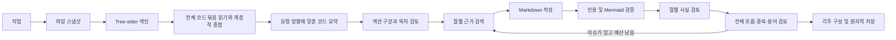

# 설계와 운영

## 실행 흐름

작업은 여러 로컬 소스, 하나의 Markdown 출력 경로, 자유 텍스트 생성 방향 및 예산으로 구성된다. 하나의 소스를 여러 목적의 작업에서 재사용할 수 있다. 실행마다 설정을 암호화한 스냅샷으로 고정한다.



상태는 `queued`, `running`, `cancelling`, `cancelled`, `interrupted`, `failed`, `completed`, `completed_with_warnings`, `awaiting_source`, `awaiting_outline`이다. 동일 출력 경로의 중복 실행은 차단하고 대기열은 64개로 제한한다. 단일 데이터 디렉터리는 프로세스 파일 잠금으로 보호한다.

기본적으로 3회 작성·검토, 2시간, 최대 200만 예약 토큰을 사용한다. 실제 비용이 입력된 모델에 대해서만 금액 예산을 적용한다. 사용량과 보수적 예약량은 구분한다. 요청 timeout이나 네트워크 오류로 실제 과금을 확인할 수 없으면 예약량은 반환하지 않는다.

## 근거와 캐시

Tree-sitter가 8개 언어의 구문과 심볼, import 및 호출 후보를 추출한다. 구문상 관계는 런타임 호출을 확정하는 의미 분석 결과가 아니다. 알 수 없는 언어는 UTF-8 텍스트 청크로 분석한다. 바이너리·지원하지 않는 인코딩·초과 크기 파일은 실행 파일 보고서에 기록한다.

파일 스냅샷은 크기·수정 시각 확인 후 저장하고 SHA-256으로 식별한다. 이는 파일별 안정된 복사이며 저장소 전체의 원자적 시점 스냅샷은 아니다. 분석 중 소스 코드를 실행하지 않는다.

캐시는 다음과 같다.

- 파싱 결과: 파서 버전·언어·파일 SHA-256.
- 공유 청크: 내용·심볼 해시. 실행별 청크 행은 공유 본문을 참조한다.
- 근거 검색: 색인 지문·검색어·입력 크기 예산.
- LLM 응답: 프롬프트 버전·endpoint·모델·생성 파라미터·입력 전체.

인용 ID는 경로·행 위치·내용의 SHA-256이므로 동일 소스 재실행에서 유지된다. 전체 이해는 색인된 모든 원문 청크를 페이지로 열거하고 요청별 예산 안에서 분할 읽는다. 500개 파일 표본과 전체 파일 수 상한을 제거했다. 완료한 묶음은 원문과 함께 체크포인트에 보존하고 계층적으로 종합한다. 전체 읽기와 일반 종합은 문서 목적과 독립적으로 유지한다. 그 뒤 요청 방향과 관련된 세부 묶음 요약을 찾아 하나의 목적별 코드 요약으로 정리한다. 최종 종합에서 빠진 관찰도 하위 묶음에서 다시 가져오며, 원문 색인 검색을 함께 수행한다. 모든 입력을 처리했다는 집계와 의미 해석의 정확성은 구분한다.

내부 초안에는 `[E:해시]` 인용을 보존하고, 게시할 때 본문은 짧은 각주로 변환한다. 각주 정의에는 원본 파일·행 범위·전체 근거 해시를 남기며 사용하지 않은 근거는 참조 목록에서 제외한다. 인용 존재 및 제공된 근거 ID 일치를 코드로 검사하고, 사실의 의미적 타당성은 별도 LLM 검토로 평가한다. 모든 사실의 진실성을 수학적으로 보장하지 않는다.

## 토큰 계약

모든 생성 요청을 중앙 예산 계층에서 검사한다.

```text
context = min(200000, 사용자 설정, 모델 한도)
input + reserved_output + safety_margin <= context
reserved_output <= model_max_output
```

reasoning과 보이는 출력을 합친 생성 상한을 예약한다. 설정한 서버 매핑에 따라 `max_completion_tokens` 또는 `max_tokens`를 보낸다. `max_tokens`가 reasoning을 포함하는지 등 서버 구현 계약은 연결 운영자가 확인해야 한다.

추정 모드는 직렬화된 요청의 UTF-8 바이트 수에 framing 여유분을 더하고 기본 20% 컨텍스트 여유분을 확보한다. 처음에는 1바이트를 1토큰으로 보지만, 4KB 이상의 요청에서 서버가 보고한 `prompt_tokens`가 토큰당 1~6바이트 범위의 표본을 3개 이상 주면 가장 조밀한 표본의 85%(최대 토큰당 3바이트)로 요청을 채운다. 표본과 최솟값은 `budget` 체크포인트에 보존한다. 서버가 크기 초과로 거절하면 해당 실행은 보정을 버리고 1바이트 1토큰으로 돌아간다. 전체 소스 읽기의 묶음 구성은 체크포인트 재사용을 위해 보정하지 않은 기준을 계속 쓴다. 보정 전 서버 usage가 추정보다 크면 실행 중 여유분을 늘린다. 컨텍스트 오류는 더 작은 근거 묶음으로 복구한다. 토큰 계산 endpoint 모드는 동일 요청 JSON을 POST하고 `{"input_tokens":123}`을 반환하는 계약이다. 채팅 템플릿과 숨겨진 서버 입력까지 포함하는 계산이어야 한다.

reasoning은 기본값·off·on을 구분한다. `reasoning_effort` 방식은 off를 `none`으로 매핑하고, 호환 서버용 `chat_template_kwargs.enable_thinking` 방식은 boolean으로 전송한다. 지원되지 않는 설정은 연결 테스트/API 오류로 보고하며 조용히 다른 파라미터로 바꾸지 않는다.

응답은 최대 4 MiB이며 네트워크를 읽는 동안에도 취소 가능하다. 공급자가 추론을 별도로 보고하는데 추론을 뺀 출력 토큰이 1,000개 이상이고 받은 본문이 토큰당 1.2바이트에 못 미치면, 공급자가 본문 일부를 제거한 것으로 본다. 실측에서는 본문 속 추론 태그 뒤가 사라졌다. 이 응답은 캐시하지 않고 `PROVIDER_CONTENT_DROPPED`로 다시 요청한다. 실측에서 본문은 응답이 꺾쇠 태그를 여는 자리에서 끊겼고, 태그 파서를 설명하는 묶음에서는 같은 자리가 반복됐다. 그래서 시스템 지시와 재요청은 추론·채팅 템플릿 태그뿐 아니라 마크업 태그까지 꺾쇠 없이 쓰라고 요구한다. 잘림이 바이트 비율 검사에 걸리지 않을 만큼 길게 도착하면 JSON이 닫히지 않은 채 끝나는데, 이 경우를 스키마 불일치가 아니라 `RESPONSE_TRUNCATED`로 구분한다. 스키마 오류로 알리면 재시도가 같은 답을 다시 써 같은 자리에서 잘렸다. 재시도 지시도 조각을 잇거나 고치는 대신 더 짧게 전체를 다시 쓰라고 바꾼다. 도착한 본문은 실행 이벤트(`content_dropped.body`, `source_validation.truncated_body`)와 서버 로그에 앞뒤 발췌로 남겨 무엇을 쓰다 멈췄는지 확인할 수 있게 한다. 모델 JSON에 흔한 깨진 문자열(이스케이프되지 않은 따옴표, 날것의 줄바꿈, 잘못된 역슬래시)은 파싱 전에 복구한다. 원문 블록은 번호 없이 근거 ID로만 연결한다. `finish_reason=length`는 성공이 아니며 작은 절로 재작성한다. 서버가 사용량에서 출력 상한 위반을 보고하면 해당 실행을 실패 처리한다. 숨겨진 서버 토큰·보고되지 않은 사용량까지 클라이언트가 절대 보장할 수는 없다.

## 중단과 복구

취소 토큰은 HTTP 요청·대기·재시도·워커 종료로 전파된다. 최종 파일 교체와 취소 수락은 짧은 commit gate로 순서를 정한다. 게시가 이미 끝난 요청에는 `accepted=false`를 반환한다. DB 기록은 비동기로 반영하고 취소 의도는 로컬 파일에 먼저 보존한다.

파서와 Mermaid 검증은 자식 프로세스에서 실행하며 timeout·kill-on-drop을 적용한다. 네트워크·DB 자원은 bounded queue, semaphore, 연결 풀로 제한한다. 외부 호출 중 공유 상태 mutex를 유지하지 않는다. 최종 파일 교체만 동기적인 짧은 임계 구간이다.

LLM 일시 오류는 제한적 backoff로 재시도한다. DB 이벤트 기록 실패 시 제한된 최신 상태 저널로 보존하고 재연결한다. transient DB 오류에 대해서는 supervisor가 최대 3회 재개한다. 영구적인 인증·권한·설정 문제는 무한 재시도하지 않는다.

재시작 시 취소 저널과 게시 저널을 복구하고 실행 중이던 작업을 체크포인트에서 재개한다. 사람의 취소는 자동 재개하지 않는다. UI의 명시적인 재개 버튼으로 다시 시작할 수 있다. 재개 시 기존 분석 설정·총 토큰 예약량을 보존하며 현재 인증 정보를 사용한다.

## 저장과 보존

기존 출력 해시가 실행 시작 때와 다르면 충돌 파일에 새 문서를 저장한다. 같은 파일시스템의 임시 파일을 원자적으로 교체하고, 게시 저널로 DB와 파일시스템 사이의 중단을 조정한다. 원자적 교체는 정상적인 파일시스템 동작을 전제로 하며 정전·네트워크 드라이브·디스크 오류까지 무조건 보장하지 않는다.

보존 기간이 지난 종료 실행·이벤트·문서 버전·스냅샷은 정리한다. 사용자가 지정한 최종 Markdown 파일은 삭제하지 않는다. 파싱·검색·LLM 캐시는 설정 용량에 따라 오래된 항목부터 정리한다. 실행에서 참조하는 공유 청크는 해당 실행의 보존 기간 동안 유지된다.

## 보안과 플랫폼

허용 루트와 출력 확장자를 검증하고 출력 symlink를 거부한다. 악의적인 로컬 관리자나 동시에 경로를 조작하는 프로세스에 대한 OS 수준 격리 도구는 아니다. 소스의 명령문과 주석은 비신뢰 데이터로 분리한다. API·DB·proxy 비밀은 AES-GCM으로 암호화하고 로컬 키를 사용한다. Unix에서는 데이터 디렉터리 0700, 비밀 파일 0600을 적용한다. Windows에서는 `icacls`로 데이터 디렉터리의 상속 권한을 제거하고 현재 사용자에게 접근 권한을 부여한다.

UI는 HttpOnly·SameSite 로컬 세션, Origin/Host 검증, Markdown HTML 비활성화 및 Mermaid strict 모드를 사용한다. 외부 폰트나 CDN 리소스 없이 동작한다.

Rust 운영 코드의 명시적 panic/unwrap/expect는 Clippy에서 차단한다. 의존성·OS·OOM까지 포함한 panic/deadlock의 절대 부재는 보장하지 않으며, 자원 제한·timeout·프로세스 격리·체크포인트로 장애 범위를 줄인다.

## 전체 문서의 일관성

목차는 독자 목표, 설명 순서, 섹션별 제목·핵심 설명·근거 검색어·원문 ID·다이어그램 목적을 중심으로 구성한다. 섹션은 코드의 관련 책임과 동작 흐름에 따라 필요한 만큼만 만들며, 상한은 브랜치 수에 따라 32~256개다. 자동 질문 생성과 질문 소유권 배정은 수행하지 않는다. 기존 목차의 질문·연결 문장·선행 절 필드는 호환용으로 읽을 수 있지만 필수 생성 항목이 아니다. 선행 절이 제공되면 앞선 절을 가리키는지 검사한다. 작성 시 이웃 절의 제목·소제목·시작과 끝을 각각 2,000바이트 문맥으로 전달하고, 사실 주장을 위한 근거는 별도로 검색한다. 작성·절별 검토 요청은 목차 전체 대신 12,000바이트 이내의 문서 보기를 받는다. 대상 절은 표시만 하고(전체 계획은 `section_plan`), 앞뒤 절과 선행 절은 핵심 설명을, 나머지 절은 제목과 짧은 요약만 싣는다. 목차 전체를 싣던 방식은 32절에서 근거 공간이 약 15KB로 줄고 40절 남짓부터 요청 자체가 한도를 넘었다.

매 검토 iteration에 전역 편집 검토를 수행한다. 한 요청의 발췌 예산은 요청 가용 공간 안에서 최대 48,000바이트이고 절마다 최소 3,000바이트를 주도록 폭을 정한다. 문서가 그보다 길면 한 절씩 겹치는 구간으로 나누어 검토하므로 인접한 두 절은 항상 한 요청에서 함께 읽힌다. 각 구간 요청은 모든 절의 제목·배정 다이어그램 수·실제 Mermaid 수와 구간 절의 계획을 받는다. 응답 또는 컨텍스트 문제로 실패하면 발췌를 절반씩 축소해 구간마다 최대 3회 시도한다. 발췌 여부를 명시해 잘린 부분을 누락으로 단정하지 않도록 한다. JSON 메타데이터 및 요청 전체에는 별도의 기존 컨텍스트 검사가 적용된다. 실패 시 일관성을 검증했다고 표시하지 않고 미해결 이슈를 남긴다. 이슈는 유효한 절 번호에만 배정하고 기존 사실 검토 이슈와 함께 다음 수정에 반영한다. 최종 문서 전체를 한 번에 재작성해 검증되지 않은 사실을 추가하는 단계는 두지 않는다.

새 실행은 `understanding`에서 전체 소스 청크를 최대 64개씩 조회하고, 설정한 LLM 동시성만큼 묶음 읽기와 같은 층의 종합을 동시에 요청한다. 묶음은 여전히 읽기 순서대로 잘리고 그 순서로 모이므로 노드 키와 트리는 순차 실행과 같다. 락 파일(`package-lock.json`, `Cargo.lock`, `go.sum` 등), 압축된 번들·소스맵, 이름이나 파일 첫 600자에 생성 표식이 있는 파일은 검색 색인에는 남기고 전체 읽기에서만 제외하며, 제외 파일·사유는 `understanding:coverage.reading_excluded`에 남긴다. 제외하면 읽을 것이 없는 소스는 그대로 읽는다. 읽기를 시작하기 전에 예상 묶음·요청·토큰·시간을 작업 한도와 비교한 `source_estimate` 이벤트를 남긴다. 청크는 요청별 가용 공간 내 최대 96,000바이트의 원문 묶음으로 읽는다. 요청별 가용 공간은 컨텍스트 한도에서 출력 한도·안전 여유분·실행 중 늘어난 여유분을 빼고, 요청 JSON이 채팅 메시지 문자열로 한 번 더 이스케이프되는 팽창분과 지시문·앵커 몫을 예약해 계산한다. 즉 `budget::check`가 거부할 요청을 애초에 구성하지 않는다. 긴 원문은 UTF-8과 행 범위를 유지하며 분할하고 각 범위의 해시를 새로 계산한다. 모든 묶음이 끝난 뒤 최대 4개씩 단계적으로 종합하되, 하위 요약과 앵커가 한 요청에 들어가지 않으면 3개·2개로 좁힌다. 중간 종합은 제한된 원문과 하위 관찰을 함께 사용하며, 원문은 하위 요약과 앵커가 쓰고 남은 공간만큼만 다시 읽는다. 하위 관찰이 인용한 원문은 체크포인트에서 유지한다. 하나의 요약은 요청 가용 공간의 1/6을 넘지 못한다. 요청은 관찰 12개와 관찰당 인용 12개를 요구하지만, 검증은 그 두 배까지 받아들이고 나머지 검사를 모두 통과한 응답을 개수만으로 돌려보내지 않는다. 브리프가 실제로 쓰는 것은 요약 예산이고 그 검사는 따로 돌기 때문이다. 실측에서 예산의 3분의 2만 쓴 읽기가 개수로 거절됐고, 압축하라는 지적을 받은 다음에는 지시대로 원문을 한 관찰로 묶었다가 인용 16개로 다시 거절됐다. 2개조차 한 요청에 들어가지 않으면 `CONTEXT_BUDGET`으로 중단하고 설정 조정을 요구한다. 마지막 전체 종합은 일부 발췌에 치우치지 않도록 하위 관찰 전체와 근거 앵커를 입력으로 사용한다. 목적별 읽기·목차 계획도 이미 읽은 근거 앵커를 이어받는다. 앵커 ID는 보존한 원문에 대조하지만, 모델 관찰을 실제 실행으로 입증된 사실로 취급하지 않는다.

`understanding:node:*`는 모델·입력 계약별 완료 묶음, `understanding:root`는 종합 결과, `understanding:coverage`는 전체 읽기 집계다. 같은 입력의 일반 읽기는 실행 간 LLM 캐시도 재사용한다. 목적별 요약은 저장된 하위 관찰을 최대 24개까지 관련도와 파일 분산을 고려해 선택하고, 일반 개요와 원문 검색 결과를 함께 읽는다. 기본 한 번 요약하며 주요 연결에 대한 구체적인 후속 검색 요청이 있을 때만 한 번 더 읽는다. 단순한 미확인 문장만으로 추가 호출하지 않는다. 요약 검증 실패는 보존한 소스 관찰과 미해결 표시로 복구해 목차 단계로 진행한다. 인증·취소·통신 재시도 소진·작업 예산 제한은 기존 중단 계약을 따른다. 컨텍스트 한도 초과(`CONTEXT_BUDGET`)는 스스로 요청을 줄일 수 있는 단계에서는 더 작은 묶음으로 재시도하고, 그럼에도 실행까지 올라오면 작업 예산과 같이 취급해 완료한 체크포인트를 남기고 `awaiting_source`·`awaiting_outline`으로 대기한다. `failed`로 끝내지 않는다.

`purpose:<분석 지문>:first/final`은 목적별 요약의 완료 체크포인트다. 분석 지문은 목적·소스 색인·일반 종합 노드·모델·입력 계약을 포함한다. 방향이 달라지면 목적별 결과와 문서 구성·초안·검토를 갱신하고, `understanding:*`와 소스 색인은 유지한다. 현재 실행의 방향은 시작 시 스냅샷으로 고정하므로 저장 작업의 방향을 수정했다면 새 실행에 적용된다. 일반 읽기 요청에는 방향이 포함되지 않는다.

목적별 개요는 최대 12개 관찰이며, 개요에서 생략된 기존 세부 관찰과 원문은 `source_understanding`에 함께 보존한다. 같은 주제를 정정한 새 관찰은 이전 관찰을 대체하고 다른 주제는 유지한다. 목차·검토 요청에는 세부 관찰의 제한된 보기(발췌 여부 표시)를 전달하고, 원문은 파일별로 순환 배정한다. 검토 중 검색한 원문도 저장 근거에서 이전 원문을 밀어내지 않는다. 본문은 섹션의 원문 ID와 추가 검색으로 필요한 내용을 확보한다. 소스 이해 화면에는 일반 요약과 요청 방향에 맞춘 요약·미확인 연결을 표시한다. 모든 단계는 기존 토큰·시간·비용 제한을 공유한다.

신규 목차 생성은 형식적인 선수 관계를 요구하지 않는다. 기존 형식의 `prerequisite_titles`가 반환된 경우에는 정확한 앞선 제목을 저장용 `depends_on` 인덱스로 변환한다. 중복 참조는 제거하고, 존재하지 않거나 뒤에 있는 절의 참조는 추측해서 수정하지 않는다. API에서 기존 선행 절을 편집하는 경우에도 순서 검증을 유지한다.

목차 검토는 사용자가 명시한 범위의 누락, 큰 중복, 읽기 순서, 섹션 수·다이어그램 조건에 집중한다. 세부 구현 근거의 검증은 본문 작성과 사실 검토에서 수행하며, 미확인 연결 하나만으로 목차 구성을 거부하지 않는다. 형식 오류는 상세 오류와 함께 재시도하고, 주요 구성 문제는 최대 2회 보정한다. 미해결 주요 문제가 있으면 `awaiting_outline`로 대기하며, 미리보기 옵션을 켠 작업은 확정 전 본문을 쓰지 않는다. 기존 질문 메타데이터는 읽을 수 있지만 질문 소유권 중복·누락을 진행 조건으로 삼지 않는다.

신규 초안 키는 섹션 ID와 계획·전역 용어·이웃·전이적인 선행 설명의 해시로 구성한다. 목차 순서만으로 다른 본문을 가져오지 않는다. 목차 변경 시 기존 검토·수정 완료 표시는 무효화하며, 관련 없는 초안은 입력 지문이 같을 때 재사용한다. 과거 ID 없는 목차는 번호 기반 초안을 그대로 읽는다. 본문 구조 검토는 최대 한 번 재계획을 요청할 수 있으며 `review_start_iteration`에 소비한 회차를 저장한다.

실행 중 직접 편집은 먼저 중단한 뒤 수행한다. 편집 요청은 기준 버전 충돌을 검사하고 요청 식별자로 중복 처리를 막는다. 사용자 대기 중에는 워커 슬롯을 점유하지 않는다. 분석 예산 부족으로 목차 확정 전에 중단되면 분석·목차 대기 상태에 저장하며, 최종 문서를 게시하지 않는다.

검색은 명시한 구현 파일을 우선하면서 동일 파일의 후속 청크가 다른 지정 파일을 독점하지 않도록 순환 배정한다. 큰 청크를 줄일 때는 앞부분만 자르지 않고 검색어가 포함된 구간을 선택하며, 행 범위와 근거 해시를 다시 계산한다. 작성용 근거는 요청별 가용 예산 내 최대 80,000바이트이며, 직렬화 후 200k 컨텍스트 사전 검사를 별도로 통과해야 한다.

수정 요청에서 4,000바이트 이상이고 소제목이 둘 이상인 초안은 소제목 단위로 나누어 보낸다. 모든 지적의 위치를 찾을 수 있으면 해당 소제목만 보낸다. 위치는 초안에 있는 인용 ID, Mermaid 파싱 오류가 가리키는 다이어그램 번호, 초안에 있는 인용 문구로 찾는다. 배정된 다이어그램이 빠진 경우에는 새 소제목 하나를 추가로 받는다. 전체 초안을 보여 주면 모델이 표식 요청을 무시하고 섹션 전체를 다시 썼기 때문이다. 위치를 찾을 수 없는 지적이 있으면 전체 소제목을 보낸다. 모델은 바꿀 소제목만 `<!-- DOCCRAFT_SUBSECTION n -->` 표식과 함께 돌려준다. 보내지 않은 소제목의 번호를 돌려주면 형식 오류다. 표식 없이 초안 절반보다 짧게 돌아온 응답도 전체 재작성으로 받지 않고 형식 오류로 처리한다. 나머지 소제목은 그대로 유지한다. 표식이 없으면 전체 재작성으로 받아들이고, 없는 번호나 중복 번호는 형식 오류로 다음 시도에 알린다. 근거를 줄이면서 유지할 소제목이 인용한 근거 ID가 바뀌면 그 시도는 전체 재작성으로 돌린다.

섹션 본문에는 고정 단어 수 상한을 두지 않는다. 모델은 요청 방향과 섹션의 핵심 설명에 맞춰 분량을 정하고, 긴 섹션은 완성된 소제목 단위로 여러 응답에 나누어 작성한다. 출력 토큰 한도에 걸린 응답의 본문도 보존하며, 다음 요청은 마지막 문자부터 이어 써 인용이나 코드 블록 중간의 잘림을 복구한다. 각 부분은 `section_output:*` 체크포인트에 저장하고, 이어쓰기 요청에는 동일한 근거와 앞선 소제목·본문 끝부분을 전달한다. 합친 본문에 기존 인용·Markdown·다이어그램 검증을 적용한다. 응답별 출력 토큰 상한과 작업 전체 시간·토큰·비용 제한은 유지하며, 이어쓰기 실패를 완성된 섹션으로 처리하지 않는다.

장별 `diagrams` 배열은 전체 문서에서 그 장이 담당할 다이어그램의 목적을 지정한다. 빈 배열은 다이어그램 없는 장을 뜻하고, 필드가 없는 과거 목차는 기존 동작을 유지한다. 작성 결과의 Mermaid 개수가 배정과 다르면 같은 근거로 제한된 수정 요청을 수행한다. 전역 편집 검토에는 발췌문뿐 아니라 전체 본문에서 센 다이어그램 수를 전달한다. 개수 검증만으로 화살표의 의미 정확성까지 보장하지는 않으며, 의미는 소스 검토 대상이다.

작업별 `max_diagrams`는 선택 상한(0~32)이며 미설정은 기존 자동 배정을 유지한다. 프론트엔드에서 관리할 수 있고 목차의 전체 배정이 상한을 넘으면 오류 이유를 전달해 최대 3회 계획한다. 장별 본문 개수 검사는 이 계획을 따르므로, 전역 상한을 넘긴 목차가 본문 작성으로 넘어가지 않는다.

검토의 형식 오류는 다음 재시도에 오류 내용과 허용 장 번호를 전달한다. 전체 검토 재시도 이벤트를 저장해 실패 원인을 모니터에서 확인할 수 있다. 모델에 전달하는 근거 ID는 충돌 없는 짧은 접두어로 줄이고, 응답을 저장하기 전에 기존 해시로 복원한다. 원본 소스 내용과 저장된 근거 해시는 바꾸지 않는다.

검토 회차의 지적은 체크포인트에서 복원하며, 수정 본문과 회차·장별 수정 완료 표시는 하나의 DB 문장으로 함께 저장한다. 재시작은 끝난 수정을 건너뛰고 남은 지적을 계속 처리한다. 다음 회차 검토가 저장되어 있으면 이전 회차의 수정이 끝났다는 근거로 그 회차 전체를 건너뛴다.

## 요청 형식

모든 요청의 JSON은 지시문과 정책처럼 호출마다 같은 필드를 앞에 둔다. 제공자의 접두어 캐시가 같은 종류의 호출끼리 재사용할 수 있게 하기 위해서다. `path`는 작업이 지정한 소스 루트 기준 상대 경로로 보낸다. 근거 원문은 JSON 문자열로 이중 이스케이프하지 않는다. JSON 안에는 `{id, passage}`만 남기고, JSON 뒤에 `<passage n=… id=… path=… lines=…>` 블록으로 원문을 그대로 붙인다. 닫는 태그에는 원문 해시인 근거 ID가 들어가므로 원문이 자기 블록을 먼저 닫을 수 없다. 원문 분류(`runtime_allowed`)는 각 원문과 앵커에 직접 붙이고, 같은 요청에 원문이 있는 근거는 앵커 목록에서 뺀다. 목차 검토는 구조만 판단하므로 원문과 인용 ID 없이 관찰만 받는다. 목차 검토와 보정 회차의 이전 목차는 전체 목차 대신 32,000바이트 이내의 목차 보기(제목·핵심 설명 발췌·브랜치 라벨, 검색어와 근거 해시 제외)로 보낸다. 절이 많아질수록 핵심 설명과 제목을 줄인다. 섹션 ID는 앞 12자만 보여 주고, 모델이 돌려준 ID는 접두어로 원래 ID에 대응시킨다. 브랜치 담당 현황도 12,000바이트 이내로 줄여 보낸다. 섹션 요청의 문서 보기는 제목만으로도 예산을 넘으면 대상 절에서 먼 절을 구간별 개수로 접는다. 전체 흐름 검토 구간은 24,000바이트의 문서 보기를 받는다.

## 소스 브랜치와 목차

목차 계획은 읽기 트리의 한 층을 브랜치(`B1`…)로 보여 주고, 자식이 둘 이상인 브랜치는 하위 파트(`B3.2`…)도 함께 보여 준다. 파트 목록이 보기 예산의 절반 이내이면 주제를 줄여서라도 싣는다. 큰 브랜치를 여러 절이 나눠 맡을 때는 각 절이 맡을 파트를 이름 짓고, 담당 현황도 파트 단위로 계산한다. 각 절은 다루는 브랜치를 `branches`로 이름 짓는다. 목적에 필요 없는 브랜치는 `excluded_branches`에 이유와 함께 남긴다. 서버는 저장 시 라벨을 노드 키로 바꾸고, 요청에 보일 때는 다시 라벨로 되돌린다. 트리를 내려갈 때 다음 층으로 그대로 넘어온 리프도 아래 층에 남겨, 브랜치 보기에서 소스 일부가 조용히 빠지지 않게 한다.

계획이 끝나면 서버가 브랜치를 담당·제외·미배정으로 계산해 `outline_coverage` 이벤트와 목차 검토 입력(`branch_coverage`)에 넣는다. 목적에 필요한 미배정 브랜치는 주요 누락으로, 필요 없는 것은 경미한 문제로 판단하게 한다. 판단이 그 브랜치를 언급하지 않으면 서버가 미배정 브랜치마다 주요 이슈(`unassigned_branch`)를 직접 만들어 검토 결과에 더한다. 어느 절이 맡을지, 새 절을 만들지, 이유를 달아 제외할지는 여전히 모델이 정하지만 결정 자체를 건너뛸 수는 없다. 실측에서 검토가 미배정 4개를 남긴 채 지적 없음으로 답한 적이 있다. 한 브랜치를 어떤 절이 맡으면서 동시에 제외 목록에도 올리면 목차를 저장하지 않고 라벨을 지목해 다시 요청한다. 담당 계산은 담당을 먼저 확인하고 그 브랜치의 제외 항목은 읽지 않으므로, 두 곳에 함께 있으면 절은 그 브랜치를 쓰고 제외 사유만 사실과 어긋난 채 남는다. 브랜치·파트를 4개 이상 맡은 섹션도 `crowded_sections`로 넘긴다. 목적이 설명을 요구하는 서로 다른 흐름이 한 섹션에 몰렸으면 분할이 필요한 주요 문제로, 한 흐름이거나 개요면 충분할 때는 경미한 문제로 판단하게 한다. 계획 지시도 "가장 적은 섹션 수"를 서로 다른 흐름을 한 섹션에 나열하는 것으로 해석하지 않도록 한다. 브랜치를 맡은 절은 앵커 없이 계획할 수 있다. 작성 시에는 그 브랜치 아래 리프의 관찰을 리프마다 하나씩 돌아가며 16,000바이트 안에서 받고(`branch_findings`), 표시된 관찰이 인용한 원문도 검색·필수 근거와 예산을 나누어 받는다. 전체 읽기가 찾은 내용을 검색 결과와 겹치는 것만이 아니라 절의 범위 전체로 전달하기 위해서다. 같은 리프에 닿는 절이 여럿이면, 절의 제목·핵심 설명·검색어와 가장 많이 겹치는 절 하나가 그 리프를 맡는다. 동점이면 지금까지 동점을 덜 가져간 절이 맡는다. 계산은 전체 리프를 읽기 순서로 한 번에 하므로 어느 절에서 계산해도 같은 결과가 나온다. 각 절은 자기 리프만, 관련도가 높은 순으로 받는다.

브랜치가 16개를 넘으면 한 요청은 브랜치마다 한 문장 정도만 보여 줄 수 있으므로 두 단계로 계획한다. 브랜치 층은 리프 수의 1/4을 목표로 최대 256개까지 넓어진다.

1단계에서는 상위 층 그룹(`G1`…)을 보고 최대 16개 장으로 나눈다. 그룹 보기에는 그룹의 주제와 소속 브랜치를 싣고, 예산을 넘으면 브랜치는 라벨만 남긴다. 장은 그룹 단위(`groups`)로도, 브랜치 단위(`branches`)로도 가져갈 수 있다. 브랜치를 따로 이름 지으면 그 브랜치는 그룹을 가져간 장이 아니라 이름 지은 장에 속한다. 제외도 그룹이나 브랜치 단위로 할 수 있다. 모든 브랜치는 정확히 한 장에 들어가거나 제외되어야 한다. 같은 그룹을 두 장이 가져가거나, 가져간 그룹을 제외하거나, 어디에도 없는 브랜치가 있으면 무엇을 고칠지 알리고 다시 요청한다.

2단계에서는 각 장을 읽기 순서대로 브랜치 16개씩 나눈 요청으로 계획한다. 각 요청은 그 브랜치 파일에 걸친 목적별 관찰·근거만 받고, 전체 요약과 무관한 근거는 받지 않는다. 근거가 없으면 절은 브랜치로 계획한다. 이전 목차는 그 브랜치를 맡았던 절과 그 절에 관한 지적만 받는다. 절 수와 다이어그램 수는 요청의 브랜치 수에 비례해 나누고, 앞선 요청의 제목은 다시 쓰지 않는다. 장 구성(`outline_chapters:<revision>`)과 요청별 결과(`outline_chapter:<revision>:<장>:<부분>`)는 체크포인트로 재개한다. 보정 회차에는 전체를 다시 계획한다.

