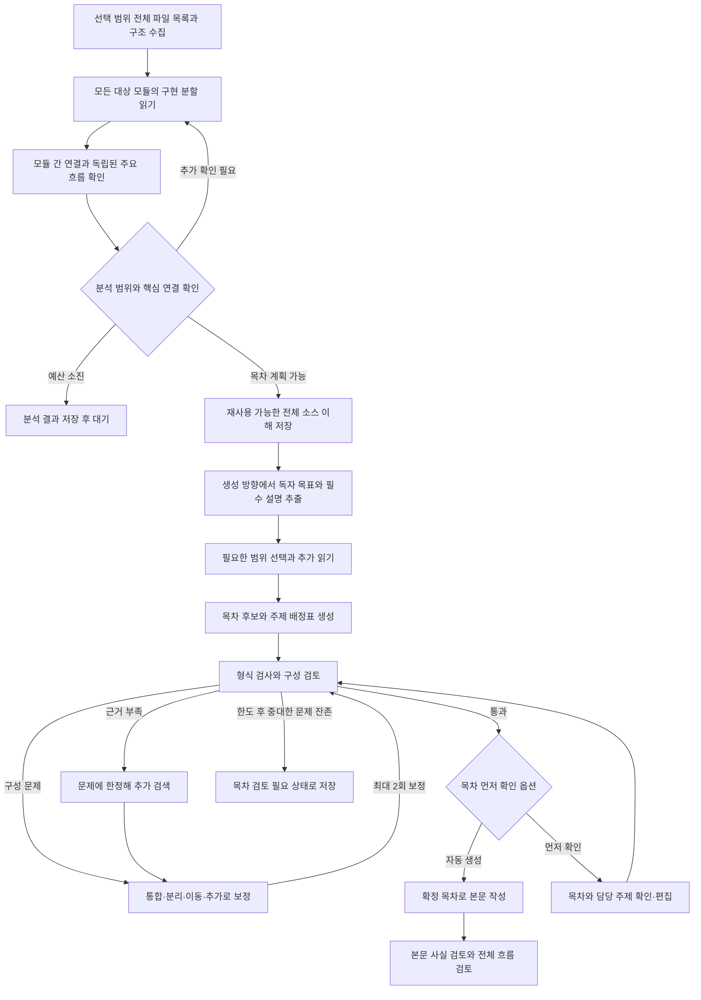

# 전체 소스 이해 기반 문서 구성 설계

2026-09-14 · 설계 및 구현 기록. 아래 제약 표는 변경 전 상태이며, 상세 데이터 모델은 목표 설계를 포함한다.

구현한 범위: 파일 수·목록 상한 제거, 모든 색인 청크의 분할 읽기와 계층 요약, 목적별 요구사항 배정, 목차 의미 검토와 최대 2회 보정, 목차 미리보기·직접 편집·재구성, 안정적인 섹션 키, 본문 작성 후 1회 재계획이다. 재계획 전후 본문 검토는 동일한 `max_iterations` 한도를 공유한다. 소스 이해와 문서 구성은 별도 탭으로 제공한다. 실행 중 편집은 먼저 중단해야 하며, 전체 분석 결과는 관찰·원문 근거·미확인 연결의 계층 구조로 저장한다. 아래의 별도 엔터티 그래프 전체를 구현한 것은 아니다.

핵심 변경은 **문서 방향과 독립된 전체 소스 이해를 먼저 만들고, 그 위에서 독자에게 필요한 섹션을 구성하는 것**이다. 전체 파일을 색인하는 것과 모듈의 역할·연결을 이해하는 것을 구분한다. 목차의 의미 검토·보정은 이 기반 위에 추가한다. 기본 사용 방식은 자동 생성으로 유지하고, 목차 미리보기·직접 편집과 작성 후 재구성을 순서대로 도입한다.

## 1. 변경 전 구현에서 확인한 제약

| 현재 동작 | 구성 품질에 미치는 영향 | 확인 위치 |
| --- | --- | --- |
| 선택 범위의 파일을 파싱하지만, 목차에 제공하는 파일 목록은 최대 500개이고 본문 관찰은 최대 12개다. | 넓은 색인이 전체 소스의 의미 이해로 연결되지는 않는다. 목록·요약의 앞부분에 없는 모듈이 계획에서 빠질 수 있다. | [source.rs](../backend/src/source.rs)의 `index`, `inventory`, [planning.rs](../backend/src/planning.rs)의 `SourceBrief` |
| import·호출 구문을 문자열 표본으로 추출한다. | 모듈 간 입력·결과·조건을 연결한 의미 모델은 없다. 동적 호출과 이름이 같은 다른 함수도 별도 해석이 필요하다. | [parser.rs](../backend/src/parser.rs)의 `parse_file` |
| 목적에 따라 검색한 소스를 1~2차로 읽고 관찰·근거·미확인 연결을 저장한다. | 사전 읽기는 이미 있지만 목적별 부분 분석이다. 모든 대상 모듈을 방문하고 관계를 종합하는 과정이 필요하다. | `read_sources`, `discover` |
| 최초 검색은 생성 방향에 공통 진입·처리·결과 검색어를 붙인 하나의 질의다. | 문서 목적별 핵심 질문이 검색에서 빠질 가능성이 있다. 실제 누락 여부는 평가로 확인해야 한다. | `read_sources` |
| 목차는 길이, 필수 필드, 정확히 같은 제목·질문, 선행 절 번호, 근거 ID, 그림 수를 검사한다. | 표현만 다른 중복, 중요한 주제 누락, 과도하게 큰 절, 의미가 맞지 않는 연결은 형식 검사를 통과할 수 있다. | `validate_outline` |
| 형식 검사를 통과한 첫 후보를 확정한다. 최대 3회 재시도는 오류 복구다. | 올바른 JSON으로 작성된 부실한 목차를 평가하고 다시 구성하는 단계가 없다. | `outline` |
| 본문 검토의 모든 지적은 기존 절 번호에 배정된다. | 섹션 추가·통합·분리·이동이 필요한 문제도 기존 본문의 수정으로 처리된다. | [model.rs](../backend/src/model.rs)의 `Issue`, [runner.rs](../backend/src/runner.rs)의 `review_coherence`, `execute` |
| 목차는 `outline`, 초안은 `section:0` 같은 키에 저장한다. | 저장된 목차의 순서를 바꾸면 다른 본문·검토 기록이 연결될 수 있다. | `execute`, `neighboring_sections`, `checkpoint_repair` |

[기존 실제 테스트](test-cases/developer-flow-results.md)에는 주요 분기 누락과 독립 경로를 섞은 설명이 기록되어 있다. 다만 [검증 기록](verification.md)의 사전 읽기 개선은 그 후 반영되었고 실제 외부 LLM으로 재측정하지 않았다. 이전 실패 기록은 회귀 평가 사례로 사용하며, 현재 버전의 실패율이나 이번 제안의 개선 효과를 측정한 결과로 취급하지 않는다.

## 2. 목표 흐름



초기 기본값은 **후보 1개 → 구성 검토 → 필요할 때 최대 2회 보정**이다. 사용자가 수정한 목차도 같은 검사를 거친다. 이 횟수는 본문 검토의 `max_iterations`와 별개이며, 자동으로 초기화하거나 늘리지 않는다.

## 3. 전체 소스 이해를 독립된 기반으로 만들기

전체 분석의 범위는 사용자가 선택한 소스와 기존 포함·제외 규칙으로 정한다. 그 범위의 모듈을 빠짐없이 다루되, 시스템 동작을 설명하는 데 필요한 역할과 연결을 계층적으로 정리한다. 생성 방향은 이 분석에서 무엇을 문서로 설명할지 결정하는 기준이다. 특정 방향과 관련 없어 보인다는 이유로 처음부터 모듈을 탐색 대상에서 빼지 않는다.

### 3.1 전체 구조 수집

**파일 목록에는 고정 개수 상한을 두지 않는다.** DB에서 페이지 단위로 끝까지 읽는다. 500개 표본이나 하나의 큰 프롬프트에 의존하지 않는다. 루트별 빌드·패키지 정의, 실행 진입점, 공개 API, 배치·스케줄 작업, 저장 구조, 설정, 테스트를 구조 정보로 수집한다. 지원하지 않는 문법·동적 바인딩·읽기 실패도 기록한다.

| 현재 제한 | 변경 설계 |
| --- | --- |
| `inventory`의 전체 조회 `LIMIT 500` | 안정된 커서로 모든 페이지를 순회한다. 페이지 크기는 한 번의 전송량이며 전체 파일 수 상한이 아니다. |
| `inventory_text`의 경로 목록 24,000바이트 중단과 상세 정보 예산 | 전체 원본 목록을 별도로 보존하고 페이지별로 제공한다. 저장·조회하는 목록을 문자열 길이로 잘라 버리지 않는다. |
| 계획 입력의 `inventory_sample` 8,000/16,000바이트 발췌 | 전체 구조 분석이 모든 목록 페이지를 처리하고, 목차에는 그 결과의 계층별 개요를 전달한다. 첫 페이지의 앞부분만 전체 소스처럼 사용하지 않는다. |
| 색인의 기본 `max_files=100000` 도달 시 중단 | 전체 파일 열거의 개수 상한을 제거한다. 기존 설정값을 전체 목록의 잘림 기준으로 재사용하지 않는다. 분석 작업량은 토큰·시간·메모리 예산과 이어하기로 관리한다. |

전체 목록 수집과 개별 파일 파싱·LLM 읽기를 분리한다. 목록은 디스크·DB에 순차 저장하고, 처리 대기열에는 한정된 묶음만 올려 메모리 사용량을 유지한다. 목록 응답에는 `next_cursor`, `has_more`, 수집 완료 여부를 제공한다. 목록 수집 중에는 현재까지의 수를 전체 확정 개수처럼 표시하지 않는다.

LLM 요청별 컨텍스트 한도는 유지한다. 한 요청에 들어가지 않는 목록·코드는 다음 묶음으로 넘기고 처리 범위를 기록한다. 중단되어도 전체 수집·분석이 완료된 것으로 표시하지 않는다. 제외·실패 파일은 별도 상태로 보고하며, 페이지 끝이나 글자 수 때문에 빠진 파일이 생기지 않아야 한다.

패키지 경계, 디렉터리, import 의존성으로 모듈 후보를 만들고 모든 대상 파일을 주 담당 모듈에 연결한다. 거대한 폴더는 공개 인터페이스와 의존성에 따라 하위 단위로 나누고, 분류되지 않은 파일을 조용히 버리지 않는다. 문서·테스트는 목적과 사용 사례를 이해하는 문맥으로 읽되 실행 사실의 구현 근거와 구분한다.

관계 추출을 현재의 짧은 문자열에서 구조화한 형식으로 발전시킨다. 소스 파일·범위, 호출 측 심볼, 대상 이름, import 경로, 구문 종류, 해석 상태를 저장한다. 언어별로 확실히 해석할 수 있는 참조부터 연결하고, 불명확한 대상은 미해결 상태로 둔다. import나 함수 이름만으로 실행 경로를 확정하지 않는다.

### 3.2 모든 대상 모듈 읽기

새로운 전체 분석에서는 각 모듈의 포함 대상 구현 청크를 작은 묶음으로 순회하며 읽는다. 먼저 모든 모듈의 진입·공개 계약을 읽고, 다음 순회에서 나머지 구현을 처리해 한 모듈만 깊게 읽다가 다른 모듈을 놓치지 않도록 한다. 큰 파일도 모든 범위를 추적하고, 생략한 범위는 읽은 것으로 집계하지 않는다. 유효한 기존 분석이 있는 청크는 재사용한다.

각 묶음은 원문과 연결된 관찰을 반환하고, 모듈별로 다음 내용을 종합한다.

- 책임과 외부에 제공하는 기능, 공개 진입점.
- 입력, 전제 조건, 핵심 판단·처리, 관찰 가능한 출력.
- 읽거나 변경하는 상태와 데이터, 호출하는 외부 시스템.
- 호출자·소비자와의 계약, 오류·취소·재시도·수명 주기.
- 원문에서 확인한 사실과 아직 확인하지 못한 연결.

요약에는 원문 근거와 하위 관찰 ID를 보존한다. 상위 요약을 다시 요약하는 과정에서도 원문으로 돌아갈 수 있어야 한다. 문서 작성은 요약을 검색 경로로 사용하며, 사실 주장은 필요한 원문을 다시 읽어 뒷받침한다. 모든 청크를 요청에 전달했다는 사실만으로 정확히 이해했다고 판정하지 않는다.

### 3.3 모듈 간 연결을 맞추고 전체 흐름 확인

모듈 요약의 호출자·소비자, 이벤트 이름, API, 저장 키·테이블을 대조해 연결 후보를 만든다. 호출하는 쪽과 받는 쪽의 원문을 함께 읽어 입력과 출력이 맞는지 확인한다. 공유 저장소나 이벤트를 통한 비동기 연결도 별도로 다룬다.

```text
Connection
  from_module / to_module / source_symbol / target_symbol?
  kind(call|event|read|write|configuration)
  condition / input / output
  support(syntax_only|implementation_supported|unresolved)
  evidence_ids[]
```

`implementation_supported`는 특정 조건에서 동작하도록 코드가 구성되어 있다는 뜻이며, 실제 서비스에서 관측했다는 뜻은 아니다. 외부 서비스 내부, 런타임 주입 대상, 선택 범위 밖의 코드에 대해서는 경계를 표시한다.

진입점별 주요 흐름을 입력 → 판단·분기 → 상태 변화 → 결과 소비 순으로 추적한다. 요청 처리, 시작·초기화, 주기 작업, 종료·취소처럼 독립된 흐름은 각각 보존한다. 한 방향의 연속 호출 목록으로 합치지 않는다. 공개 진입점은 흐름 그룹에 배정하거나 미확인 사유를 남기고, 연결 수가 적은 작은 모듈도 외부 진입점이나 결과 소비자이면 반드시 살핀다.

### 3.4 이해 결과와 완료 조건

```text
ProjectUnderstanding
  schema_version / analysis_id / source_manifest_hash
  modules[]                  // 역할·계약·관찰·근거
  connections[]              // 근거와 조건이 있는 연결
  flows[]                    // 서로 구분한 주요 흐름과 분기
  unresolved_questions[]
  coverage                   // 대상·제외·실패·실제 읽기 범위
```

실제 저장은 모듈·묶음·흐름 단위로 나누고 최상위 항목에는 참조와 요약을 둔다. 전체 결과를 매 LLM 요청에 넣지 않는다. 목차 생성은 전체 모듈·흐름 개요를 빠짐없이 요약한 계층과 목적에 관련된 원문을 사용한다. 깊은 세부 정보는 담당 모듈에서 다시 가져온다.

목차로 넘어가는 조건은 대상 모듈 모두에 기본 분석과 상태가 있고, 읽지 않은 대상 범위가 남아 있지 않으며, 문서에 필요한 핵심 흐름의 진입·결과·주요 분기가 근거 또는 명시적인 미확인 항목으로 정리된 것이다. 미확인 사항이 문서의 핵심 결론을 좌우하면 추가 확인하거나 분석 필요 상태로 남긴다. 주변부의 한계는 공개한 상태로 범위를 정할 수 있다.

UI에는 “구현 파일 읽기 300/400”, “주요 흐름 확인 6/8”, “미확인 연결 5개”처럼 측정 대상을 표시한다. 이를 “이해도 75%”로 바꾸지 않는다. 파서 성공·청크 전달·의미 검토를 각각 구분한다. 분모는 소스 목록에서 계산하고 LLM이 선택한 파일만으로 줄이지 않는다.

### 3.5 비용, 재사용, 중단

전체 읽기에는 소스 크기에 따른 비용이 든다. 실행 전에 미분석 청크와 크기, 묶음 수를 계산하고 초기 요청의 실제 사용량으로 나머지 비용 범위를 갱신한다. 읽기·관계 확인·목차·본문·검토를 같은 총 예산에서 관리한다. 예산이 부족하면 완료한 분석을 저장하고 `awaiting_source`로 대기한다. 분석이 끝났다고 표시하거나 필수 범위를 조용히 생략하지 않는다.

계획 전 자동 추가 확인은 미해결 질문별 최대 2회부터 시작하고, 같은 질문·근거·응답의 반복은 중단한다. 묶음 읽기와 연결 확인의 상태를 각각 저장해 이어하기가 완료된 LLM 요청을 반복하지 않도록 한다. 부분적으로 읽은 묶음은 완료로 승격하지 않는다.

캐시는 목적과 독립된 모듈 관찰과 연결을 저장한다. 키에는 정렬한 파일 경로·내용 해시, 파서·분석 스키마·프롬프트 버전, 모델·생성 설정, 참조한 의존 계약의 지문을 포함한다. 생성 방향이 달라져도 같은 소스 이해를 재사용하고, 문서 의도·목차·본문은 별도로 생성한다.

파일 추가·삭제, 공개 인터페이스 변경, import 해석·설정 변경은 해당 모듈과 영향을 받는 연결·흐름을 무효화한다. 본문을 읽지 않아도 되는 캐시 재사용 범위는 의존 근거의 해시까지 일치할 때로 제한한다. 기존 스냅샷은 파일별 복사이므로 저장소 전체의 원자적 시점이라고 주장하지 않고, 수집 중 변경이 감지되면 재수집하거나 불일치를 표시한다.

분석 캐시의 원문 참조는 실행 보존 정리 후에도 유효하도록 보존 정책을 연결한다. 참조 원문이 정리되었으면 현재 선택 범위의 동일 해시 스냅샷으로 재연결하거나 다시 읽는다. 과거 캐시 때문에 이번 작업에서 제외한 파일의 내용을 사용하지 않는다.

예를 들어 DocCraftAgent를 분석한다면 설정·작업 생성 → 소스 스냅샷 → 색인·이해 → 목차·본문 → 검토 → 게시·충돌 처리의 연결을 살피고, 취소·복구·보존은 각 경로와의 조건부 연결로 정리한다. 이 전체 이해에서 개발자에게는 처리 흐름을, 운영자에게는 준비·실행·문제 확인을 중심으로 문서를 구성한다. 이 예시는 분석 설계의 예상 구분이며 새 전체 분석을 수행한 결과는 아니다.

## 4. 생성 방향을 검증 가능한 요구로 정리

자유 텍스트 입력은 유지한다. 전체 소스 이해를 바탕으로 별도 LLM 요청에서 문서 의도를 구조화하고, 목적별 추가 읽기와 목차 검토가 같은 요구 목록을 사용하게 한다. 문서 방향을 더 일찍 해석하더라도 전체 소스 분석 대상의 축소 기준으로 사용하지 않는다.

```text
DocumentIntent
  audience / reader_goal / document_kind
  requirements[]
    id / question / priority(must|should)
    origin(user|inferred) / source_quote
  exclusions[]
  requested_section_range? / diagram_requirements[]
```

- 사용자가 명시한 요구는 원문 인용과 연결한다. 코드는 인용이 실제 입력에 존재하는지 검사한다. 사용자가 정하지 않은 독자·목적 추정은 별도로 표시한다.
- 예: “신규 개발자가 질문 처리 흐름과 취소를 추적”은 “어디서 시작하는가”, “무엇을 결정하는가”, “결과를 어디서 확인하는가”, “취소는 어디까지 전파되는가”로 구체화한다.
- 요구 목록은 목차보다 먼저 고정한다. 목차에 없는 주제를 요구 목록에서도 삭제해 검토를 통과시키지 않는다. 사용자의 명시적 제외·수정은 새 의도 버전으로 기록한다.
- 추정한 요구를 모두 필수로 승격하지 않는다. 사용자 요청과 무관한 설치·보안·운영 장이 습관적으로 추가되는 일을 줄인다.
- 문서 종류는 질문과 평가 기준을 고르는 힌트다. 개발자 흐름 문서, 관리자 안내, VOC 참고 자료에 같은 실행 순서를 강제하지 않는다.
- 명시한 장 수와 그림 수의 충돌을 계획 전에 표시한다. 첫 구현의 장 수 지원 범위는 현행 1~8개이며, 범위 밖의 명시적 요청을 조용히 무시하지 않는다.

설정 화면에는 독자·필수 포함·제외 내용을 보완하는 선택 입력을 둘 수 있다. 입력란을 채우지 않아도 기존 생성 방향에서 추출해 진행한다.

## 5. 전체 이해에서 문서 범위 선택과 주제 배정

### 질문별 근거 수집

전체 소스 이해에서 관련 모듈·흐름·미확인 연결을 먼저 선택한다. `source::retrieve`와 현재 검색별 순환 배정은 목적별 심화 읽기에 재사용한다. 2~4개 질문으로 원문을 보충하되 요청 전체 근거 예산은 유지한다. 한국어 질문에 관련된 파일·심볼은 전체 이해에서 관찰한 이름으로 보완한다. 이 검색만으로 전체 소스 분석을 대체하지 않는다.

흐름 문서라면 진입·핵심 결정·결과 소비·중요 대체 경로를, VOC 문서라면 기능·사용 조건·오류·제약을 우선한다. 모든 유형에 같은 검색 세트를 붙이지 않는다. 중요한 항목이 없으면 다음을 구분한다.

- 아직 검색하지 못함: 해당 질문과 관찰된 식별자로 추가 조회한다.
- 확인한 소스 범위에서는 판단할 수 없음: 미확인 항목으로 기록한다.
- 요청 범위 밖임: 제외 사유를 남긴다. 명시적 필수 요구의 제외에는 사용자의 범위 변경이 필요하다.

근거를 못 찾았다는 이유만으로 기능이 없다고 판정하지 않는다. 추가 읽기로 발견한 원문도 저장하고, 계획과 본문이 동일한 근거 ID를 다시 읽을 수 있어야 한다.

### 섹션의 담당 범위

기존 `reader_question`, `handoff`, `depends_on`, `evidence_ids`, `diagrams`에 다음 정보를 보완한다.

```text
SectionPlan
  id                         // 표시 순서와 분리한 식별자
  owns_requirement_ids[]     // 이 절에서 충분히 설명할 요구
  references_requirement_ids[] // 짧게 언급하고 담당 절로 연결할 요구
  key_points[]              // 질문에 답하기 위해 필요한 핵심 설명
  out_of_scope[]            // 다른 절이 설명할 내용
  depth(overview|working|reference)

CoverageEntry
  requirement_id / owner_section_id?
  evidence_status(supported|partial|unresolved)
  evidence_ids[] / gap_reason?
```

배정표는 서버가 절의 담당 요구로부터 계산한다. 각 필수 요구에는 주 담당 절이 하나 있어야 한다. 개요에서 요약하고 상세 장으로 연결하는 것은 허용한다. 같은 근거를 사용한다는 이유만으로 중복으로 판정하지 않는다.

`key_points`로 절의 크기와 구체성을 검사한다. 제목만 있고 설명할 내용이 없는 절은 보충하거나 합치고, 독립적인 여러 질문을 한 절에 몰아넣으면 분리한다. 섹션 수는 독자 질문과 설명 깊이에 맞춰 정하며, 모든 문서를 같은 장 수로 맞추지 않는다.

배정 여부와 근거 충분성은 따로 집계한다. “요구 5개를 모두 배정”했다는 사실을 “소스를 완전히 이해”했다는 뜻으로 표시하지 않는다.

## 6. 본문 작성 전 구성 검토와 보정

### 코드 검사와 의미 검토의 역할

| 검사 | 판정 방식 |
| --- | --- |
| 필수 필드, 유효한 ID, 장·그림 수, 누락된 요구 배정 | 코드 검사 |
| 중복 담당 요구, 선행 절의 순서·순환 참조 | 코드 검사 |
| 제목이 달라도 같은 설명을 반복하는가 | LLM 구성 검토 |
| 필수 질문에 답할 핵심 내용과 근거가 충분한가 | LLM 구성 검토와 원문 대조 |
| 설명에 필요한 개념이 먼저 등장하는가 | LLM 구성 검토 |
| 독립된 흐름·조건 분기를 하나의 실행 순서로 오해하게 하는가 | LLM 구성 검토와 원문 대조 |
| 각 절의 크기·깊이가 목적에 맞는가 | LLM 구성 검토 |

검토 요청에는 의도, 전체 소스의 모듈·흐름 개요, 전체 목차, 배정표, 관찰, 필요한 원문을 전달한다. 목차에 빠진 중요한 흐름을 전체 이해와 대조한다. 작성 요청과 분리된 호출로 수행하며 기존 설정의 모델을 사용할 수 있다. 별도 호출만으로 독립적인 사실 검증이 보장되는 것은 아니다.

구성 이슈는 기존 본문 `Issue`와 분리한다.

```text
OutlineIssue
  code(missing_topic|overlap|order|scope|granularity|unsupported_flow|evidence_gap)
  severity(major|minor)
  section_ids[] / requirement_ids[]
  plan_quote? / evidence_ids[]
  reason / required_change
```

누락은 요구 ID로, 중복·순서 문제는 해당 절과 구절로, 실행 관계 문제는 원문 근거로 설명해야 한다. “더 자연스럽게” 같은 평가만으로 보정을 요청하지 않는다. 발췌에서 보이지 않는 내용을 전체 소스에 없다고 판정하지 않는다.

### 보정 결정

1. 중대한 구성 문제가 없으면 목차를 확정한다. 경미한 표현 지적만으로 계속 다시 만들지 않는다.
2. 구성 문제는 `merge / split / move / add / remove / rescope` 제안으로 변환해 완성된 새 후보를 만든다. 필수 요구, 사용자가 고정한 절, 그림 예산을 보존한다.
3. 근거 부족 문제는 추가 검색 후 후보를 수정한다. 구성 검토 이후의 추가 검색은 전체 보정 과정에서 최대 3개로 제한하고, 해결되지 않은 사항은 유지한다.
4. 수정 후보에 형식 검사와 전체 구성 검토를 다시 수행한다. 미해결 주요 문제, 새로 발생한 주요 문제, 요구 배정을 이전 후보와 비교한다. 필수 요구 손실이나 새 주요 결함이 있는 후보는 채택하지 않는다.
5. 의미상 같은 후보가 되풀이되거나 주요 문제가 줄지 않으면 조기 종료한다. 정규화한 내용 해시와 이슈 코드·대상 조합을 함께 기록해 불필요한 반복을 줄인다.
6. 한도에 도달해 주요 문제가 남으면 `awaiting_outline` 상태에 후보와 사유를 보존한다. 본문 생성·최종 파일 교체는 시작하지 않는다. 사용자는 범위를 조정하거나 목차를 편집해 새 검토를 요청할 수 있다.

필수 주제의 근거가 끝내 없으면 제목을 삭제해 통과시키지 않는다. 확인 가능한 범위로 요구를 바꾸거나, 그 부분을 미확인으로 설명하는 범위를 사용자가 선택할 수 있게 한다. 검토 실패·예산 부족도 검토 통과와 구분한다.

### 비용과 중단

전체 소스 이해를 처음 만드는 비용은 미분석 묶음 수와 연결 확인 수에 따라 달라진다. 이를 기존 흐름 대비 고정 1~2회 추가라고 계산하지 않는다. 같은 소스 이해를 재사용할 때는 의도 정리와 구성 검토가 각각 1회씩 필요하고, 목적별 심화 읽기·재계획·재검토는 필요할 때 추가된다. JSON·네트워크 복구 호출도 모두 기존 총 토큰·시간·비용 제한을 사용한다.

총 예산을 고정 비율로 나누기보다 미분석 소스 크기와 예상 본문 분량으로 단계별 예약을 계산한다. 각 요청을 직렬화한 뒤 기존 예산 계층으로 검사한다. 필수 분석을 마치고 작성·검토할 여유가 없다면 상태를 저장하고 부족한 단계를 알린다. 한도 초과를 이유로 전체 이해·검토를 생략하거나 사용자 예산을 자동 증액하지 않는다.

## 7. 소스 이해·목차·실행 화면

작업 생성 시 기본값은 **자동 생성**이며, 선택 옵션으로 **목차 먼저 확인**을 제공한다. 실행 상세에는 **소스 이해**와 **문서 구성** 탭을 추가한다. 소스 이해 탭은 모듈 역할, 주요 흐름, 확인 범위와 미해결 연결을 보여주고, 실제 근거로 이동할 수 있게 한다. 소스 전체의 분석 결과와 이번 문서가 다루는 범위를 구분해서 표시한다.

각 섹션은 제목, 해결할 독자 질문, 핵심 설명, 선행 설명, 근거 상태를 보여준다. 사용자가 모든 검색 질의나 근거 해시를 이해해야 하는 화면은 만들지 않는다. 근거 파일과 상세 검토 이유는 펼쳐 볼 수 있게 한다.

본문 작성 전에는 제목·질문·포함 범위 변경, 순서 이동, 통합·분리·추가·삭제를 지원한다. “정상 요청을 하나의 예시로 연결해줘” 같은 피드백 재구성도 제공한다. 확정하려면 충돌하는 요구 배정·선행 설명·중대한 구성 문제를 해소해야 한다.

`awaiting_source`는 전체 분석을 마치지 못한 상태이고, `awaiting_outline`은 사용자 확인 옵션과 품질 검토 실패를 `reason`으로 구분한다. 이 상태들은 워커·LLM 슬롯과 실행 시간 계측을 점유하지 않고, 이미 사용한 토큰·비용·실행 시간은 보존한다. 서버 재시작으로 자동 작성·게시되지 않는다. 분석은 동일 소스 스냅샷에서 한도를 명시적으로 조정해 계속할 수 있다. 목차 검토 초기 단계에서는 문제 확인과 작업 편집·새 실행을 제공하고, 다음 단계에서 같은 실행의 목차 편집·계속하기를 연결한다.

API 추가안:

| API | 동작 |
| --- | --- |
| `GET /api/v1/runs/{id}/understanding` | 전체 소스 분석 상태·모듈·흐름·범위 요약, 상세 항목은 페이지 단위 조회 |
| `POST /api/v1/runs/{id}/understanding/continue` | 동일 스냅샷과 누적 예산에서 남은 분석 재개; 저장한 새 한도 적용은 명시적 옵션 |
| `GET /api/v1/runs/{id}/outline` | 현재 후보·확정 목차·배정표·검토 결과·편집 가능 여부 |
| `POST /api/v1/runs/{id}/outline/revisions` | `base_revision`, 요청 식별자, 직접 편집 또는 피드백으로 새 후보 생성 |
| `POST /api/v1/runs/{id}/outline/continue` | 현재 검토를 통과한 `revision`을 확정하고 작성 대기열에 넣음 |

오래된 화면에서 제출한 버전은 409로 거부하고 최신 변경을 보여준다. 동일 요청 식별자의 재시도는 이미 생성한 결과를 반환한다. 일반 작업 편집은 새 실행의 설정에 적용하며, 기존 실행의 의도 변경은 위 수정 작업으로 명시적으로 기록한다.

## 8. 본문 작성 이후 재구성: 별도 구현 단계

첫 단계는 본문 작성 전 품질을 개선한다. 작성 후에는 전체 검토에서 `scope=outline`인 문제를 보고할 수 있게 확장한 뒤, 버전별 저장과 재사용 규칙을 도입한다.

### 안정적인 식별과 저장

신규 형식은 `schema_version=2`, 증가하는 `revision`, 서버가 관리하는 `section_id`를 사용한다. 선행 절도 ID로 연결하고 표시 번호는 순서에서 계산한다. 모델이 새 절에 붙인 임시 ID는 서버가 치환하고 참조 무결성을 검사한다. 기존 절을 의미 그대로 유지할 때만 같은 ID를 유지한다. 통합·분리는 새 ID와 이전 절의 연결 기록을 남긴다.

```text
outline:v2:<revision>                       // 변경하지 않는 목차 내용
outline_review:v2:<revision>:<attempt>      // 해당 버전의 검토
outline_state                             // 후보·활성 버전·상태·사용한 보정 횟수
section:v2:<revision>:<section_id>          // 본문과 생성 입력 지문
review:v2:<revision>:<iteration>            // 해당 목차 버전의 본문 검토
repair:v2:<revision>:<iteration>:<section_id>
```

기존 `Outline`, `section:{i}`, `review:{iteration}`는 기존 읽기 경로로 재개한다. v2로 전환할 때만 순서에 맞춰 ID를 부여하고 검증한 뒤 새 버전에 저장한다. 이미 게시된 산출물은 해당 목차 버전을 계속 참조한다.

### 본문 재사용 규칙

| 변경 | 처리 |
| --- | --- |
| 새 절, 담당 주제·질문·근거·그림 배정 변경, 통합·분리 | 해당 절을 재작성 |
| 절 삭제 | 새 문서에서 제외하고 이전 버전에는 보존 |
| 제목·순서만 변경 | 본문 내부 절 참조, 도입·마무리 연결을 검토하고 필요한 부분 수정 |
| 선행 절의 설명 결과·범위 변경 | 그 결과에 의존하는 절을 전이적으로 재검토하고 필요 시 수정 |
| 전역 독자 목표·용어 변경 | 전체 본문을 재검토하고 영향 절 수정 |

같은 ID만으로 본문을 재사용하지 않는다. 절의 질문·범위·근거·선행 설명·이웃 절·전역 문서 의도 등의 입력 지문을 비교한다. 지문이 달라진 초안은 재검토 전까지 게시 가능한 것으로 취급하지 않는다. 변경과 무관한 절은 보존하되, 모든 재구성 후 전체 문서 검토를 다시 수행한다. 이전 버전의 검토 통과 표시를 승계하지 않는다.

실행 중 수정 요청은 다음 안전한 섹션 경계에서 반영한다. 현재 요청의 완료 결과는 시작할 때의 버전에 저장한다. 후보 작성·검증·영향 계산을 마친 뒤 활성 버전과 작업 목록을 한 트랜잭션으로 전환한다. 제출한 기준 버전과 현재 버전이 같을 때만 전환한다.

게시 직전에도 작성 버전과 활성 버전, 미처리 수정 요청을 commit gate와 함께 확인한다. 수정이 먼저 수락되면 구버전 게시를 막고, 게시가 먼저 완료되면 후속 문서 버전 작업으로 처리한다. 수정 요청 접수부터 이 순서를 적용해 마지막 순간의 변경을 놓치지 않는다.

자동 재구성은 첫 전체 초안 검토 후 최대 1회로 시작한다. 같은 실행에서 추가로 필요한 구조 변경은 사용자에게 제안으로 남긴다. 이 한도는 재시작·이어하기로 초기화하지 않는다. 재구성 도중 예산이 소진되면 서로 다른 목차 버전의 본문을 합쳐 부분 게시하지 않는다. 기존 게시본과 미완성 새 버전의 상태를 구분해 보존한다.

## 9. 개발 순서와 변경 위치

| 단계 | 구현 범위 | 완료 조건 |
| --- | --- | --- |
| 1. 전체 소스 이해 | 전체 범위 수집, 모든 모듈 분할 읽기, 모듈 간 연결·주요 흐름 확인, 범위 표시·캐시·이어하기 | 특정 문서 방향과 독립된 전체 역할·연결 개요와 원문 근거를 확보함 |
| 2. 자동 목차 품질 개선 | 의도 추출, 주제 배정, 구성 검토, 최대 2회 보정, 검토 필요 상태와 사유 표시 | 부실한 목차가 본문 작성 전에 검출·보정되거나 명확한 사유로 보류됨 |
| 3. 목차 확인·편집 | 문서 구성 탭, 미리보기 옵션, 직접 편집·피드백, 버전 충돌 처리 | 본문 작성 전에 같은 실행의 구성을 바꾸고 이어갈 수 있음 |
| 4. 작성 후 재구성 | v2 저장, 구조 이슈 분리, 영향 절 재작성, 게시·복구 연결 | 순서를 바꿔도 초안과 검토 기록이 다른 절에 연결되지 않음 |

1단계에서는 새 `understanding.rs`를 두고 `source.rs`의 범위·청크 열거, `parser.rs`의 구조화된 관계를 입력으로 모듈·연결·흐름 분석을 수행한다. 처음에는 기존 체크포인트와 내용 해시를 활용하되 목적과 독립된 분석 캐시·참조 원문 보존에는 별도 저장 구조를 추가한다. `runner.rs`는 색인 → 전체 이해 → 문서 계획 순서로 연결하고 `AwaitingSource`를 처리한다.

2단계의 중심은 `planning.rs`와 새 `outline_review.rs`다. `model.rs`에 의도·배정·검토 결과 형식을 추가하고 전체 이해와 목적별 원문 검색을 함께 사용한다. `runner.rs`는 계획 결과를 `Ready`와 `AwaitingOutline`로 구분해 본문 시작 여부를 결정한다.

후보·검토·추가 근거는 각각 체크포인트에 보존하고, 2단계에서 최종 목차와 확정 근거 묶음·검토 상태를 함께 커밋한다. `section_evidence`가 전체 이해와 확정된 추가 근거도 읽도록 변경해야 한다. 현재 `source_understanding`만 조회하는 경로를 그대로 두면 새 분석·재계획의 근거를 본문 작성에서 찾지 못한다.

후보가 검토를 통과하기 전에는 기존 `outline` 확정 키를 쓰지 않는다. 이미 확정 목차가 있는 과거 실행은 기존 방식으로 재개한다. 코드 배포만으로 진행 중 목차를 다시 만들지 않는다.

`api.rs`, `frontend/src/main.tsx`, API 생성 타입에는 상태·조회·편집 계약을 반영한다. 새 상태 추가 시 `busy`, 이벤트 스트림 종료 판정, 재시작 복구, 취소, 보존 정책을 함께 점검한다. 사용자 대기 상태를 실행 중·성공 완료로 오인하면 안 된다. 4단계에서는 `db.rs`의 원자적 전환·수정 기록, `publish.rs`와 부분 게시, `maintenance.rs`의 정리 대상까지 목차 버전에 맞춘다.

## 10. 검증 계획

자동 검토 모델의 자체 점수 대신 고정한 요구와 원문을 기준으로 평가한다. 목표 수치는 출시 판정용 제안이며 아직 측정한 성능이 아니다.

- 500개 경계, 24,000바이트를 넘는 긴 경로 목록, 100,000개를 넘는 메타데이터 fixture, 여러 소스 루트로 전체 목록 열거를 검사한다. 모든 페이지를 합친 파일 집합이 원본과 정확히 일치해야 한다. 대량 목록 검사는 모의 데이터로 수행하고 파일 수만큼 실제 LLM을 호출하지 않는다.
- 거대한 단일 모듈, 작지만 중요한 진입 모듈을 포함해 읽기 범위가 누락되지 않는지 확인한다. 제외·실패 파일도 분모와 사유가 정확해야 한다. 목록 조회 중 재시작에서 중복·누락이 없어야 한다.
- 서로 다른 모듈에 생산자·소비자가 있는 이벤트, 이름이 같은 다른 함수, 동적 주입, 요청과 배치가 같은 저장소를 사용하는 사례로 연결을 검사한다. 구문 후보를 실제 호출로 잘못 확정하지 않아야 한다.
- 파일·인터페이스·설정 변경 시 관련 관찰·연결·흐름만 적절히 무효화되는지, 생성 방향만 바꾸면 전체 이해가 재사용되는지 검사한다. 캐시의 참조 원문 정리와 이어하기도 포함한다.
- 형식은 정상이나 의미가 중복인 목차, 필수 주제 누락, 선행 설명 역전, 한 절로 몰린 질문, 근거 없는 실행 연결을 각각 고정 사례로 만든다.
- 개요의 짧은 언급과 상세 설명, 같은 파일의 서로 다른 주제, 좁은 문서의 적은 장 수는 정상 사례로 포함한다. 좋은 목차가 불필요하게 다시 작성되는지도 측정한다.
- 모의 LLM 통합 검사는 검출 응답 이후 보정·추가 읽기·재검토·중단·횟수 한도가 작동하는지 확인한다. 모의 응답 성공을 의미적 품질 향상으로 계산하지 않는다.
- 계획 검토 중 프로세스 종료, DB 장애, 토큰 소진, 중복 요청, 오래된 버전 제출에서 완료 기록과 예산을 보존하는지 검증한다.
- 작성 후 이동·통합·삭제와 게시 직전 수정을 검사한다. 다른 절 본문 연결, 검토 버전 혼합, 구버전 게시가 없어야 한다.
- 실제 평가에는 개발자 흐름, 관리자 안내, VOC 참고, 좁은 기능 문서를 사용한다. 기존 `developer-flow`의 입력·소스 스냅샷·모델 설정을 고정해 현재 버전, 전체 이해만 추가한 버전, 구성 검토까지 추가한 버전을 각각 최소 3회 비교한다. 정확한 동일 모델 설정을 사용할 수 없다면 비교 조건의 차이를 기록한다.
- 목차 평가는 기준 요구 누락, 중복 담당, 설명 순서 오류, 근거 없는 경로 연결을 사람이 원문과 대조해 판정한다. 조건을 가린 비교를 우선하고 본문 완성도도 표본 확인한다.
- 초기 합격 목표는 고정 사례에서 주요 구성 결함 50% 이상 감소, 정상 목차의 불필요한 보정 10% 이하, 필수 요구의 무단 삭제 0건이다. 추가 토큰·시간, 보류율, 최종 문서 품질도 함께 보고한다. 보류한 결과를 제외해 개선율을 높이지 않는다.

구현 검사는 관련 Rust 단위·통합 검사, Clippy·포맷, OpenAPI 타입 생성, 프론트엔드 빌드와 소스 이해·목차 화면 Playwright로 마친다. 실제 LLM 평가는 별도로 수행한다. 우선 1단계의 전체 이해가 놓치던 모듈·분기를 회복하는지와 최초 분석·캐시 재사용 비용을 확인하고, 같은 평가셋을 유지하면서 나머지 단계를 이어가는 순서를 권장한다.
